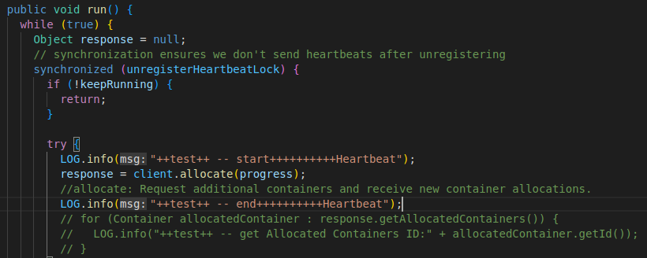

# BUG Analysis
Due to the problem of the image path, some images cannot be displayed. See Bug_Analysis.pdf for complete information.
## [Bug Selection](https://issues.apache.org/jira/browse/FLINK-12342)

## Set Up The Environment

Deploy 3 Centos virtual machines, namely node1, node2, node3 ([reference website](https://www.bilibili.com/video/BV1CU4y1N7Sh/?spm_id_from=333.337.search-card.all.click&vd_source=82763dcd5887163b50e066bd0f421b7d)) and install hadoop3.3.0 on all of them. 

install flink1.6.4 on node1.

but in the end, it seems two Centos virtual machines is enough. And other versions of hadoop should not affect the reproduction of the bug. Since after installing hadoop2.4.1, the bug still occurs

### Install Maven 3.2.5

[download website](https://maven.apache.org/download.cgi)；[Installation Guide](https://blog.csdn.net/m0_66557301/article/details/124451081?utm_medium=distribute.pc_aggpage_search_result.none-task-blog-2~aggregatepage~first_rank_ecpm_v1~rank_v31_ecpm-1-124451081-null-null.pc_agg_new_rank&utm_term=ubuntu%E5%91%BD%E4%BB%A4%E5%AE%89%E8%A3%85maven&spm=1000.2123.3001.4430)；

### Install java 8

[java JDK8](https://blog.csdn.net/qq_32279165/article/details/114833213)；

### Install Flink release 1.6.4

```terminal
#download from https://flink.apache.org/downloads.html#all-stable-releases and tar -zxvf Archive file
cd flink-1.6.4
mvn clean package -DskipTests # this will take up to 10 minutes
```

installed flink1.6.4 successfully:

```terminal
[INFO] ------------------------------------------------------------------------
[INFO] Total time: 42:49 min
[INFO] Finished at: 2022-09-01T18:30:03+08:00
[INFO] Final Memory: 432M/1989M
[INFO] ------------------------------------------------------------------------
```

## Process to reproduce the bug

bug selection: just start with the first one without too much consideration. 

The core features of the [bug](https://issues.apache.org/jira/browse/FLINK-12342): 

​	the resource request is actually sent in each of heartbeat. If the existing pending request N is not removed yet, the new added request will be added as N +1 and be sent to ResourceManager. For the issue we observe, I think it is caused by `FAST_YARN_HEARTBEAT_INTERVAL_MS = 500` is set during the resource allocation triggered by SlotManager.

​	**Therefore, if the number of containers requested by the submitted job is less than the number of containers actually allocated, the bug is successfully reproduced.**

Build three virtual machines: node1, node2, node3. 

node1:

```terminal
#in folder /export/server/hadoop3.3.0/sbin 
./start-all.sh #start the hadoop cluster
#http://node1:9870/ can check the info of cluster;
```

node3:

```terminal
nc -l 8000 #perpare to submit the WordCount
```

When the hadoop cluster starts successfully, node1:

```terminal
#in folder /export/server/flink-1.6.4/build_target/bin
./flink run -m yarn-cluster -yjm 1024 -ytm 1024 -p 10 ../examples/streaming/SocketWindowWordCount.jar --localhost node3 --port 8000
```

Check http://node1:8088/;

the above command ask for 11 containers(-yjm 1024, -p 10, 1+10=11). But more than 11 containers are actually allocated (the number of containers allocated varies)


## Dig More

This part helps us to understand this bug from an execution level.


when running the command:

```terminal
./flink run -m yarn-cluster -yjm 1024 -ytm 1024 -p 10 ../examples/streaming/SocketWindowWordCount.jar --localhost node3 --port 8000
```

the local will reate Flink YARN Client, the client will upload Flink JAR package and configuration file to HDFS and connect to YARN Resource Manager to ask for the first container to allocate AppMaster Container. Inside this container. Flink jobManager runs in this container. Flink jobManager will parse the submitted job and figure out how many additional containers that the job needs (-p parameter in the command). With the help of YARN APP Master, JobManager will connect to YARN Resource Manager and ask for required containers。Resource Manager will return some information including containerID. Then, job Manager will start these containers and deploy TaskManager inside. After that, these Task Managers will get registered in the Job Manager. The JMG will distribute the submitted job to the corresponding TMG for execution. During this process, TMG will obtain the corresponding Jar package and configuration file from HDFS. This is how it works.

When Flink Yarn JobManager is connected to YARN Resource Manager and asking for containers to deploy taskmanagers,  we need to focus on three threads that are created in JobManager: (Ignore other threads for now)


thread 1(main thread): After parsing the submitted job, the main thread will know how many containers the job needs to apply for. For example, in the command we executed, we learned that the task required for 10 containers. So a queue is created in this main thread and 10 requests are added to it (request queue) . These requests will be deleted according to the allocation process.

thread 2: HeartBeat Thread will send information to Yarn Resource Manager at intervals of `FAST_YARN_HEARTBEAT_INTERVAL_MS`.  Now we only focus on the request for containers in the information (get the number of containers that need to be applied from the request queue in the main thread). Thread 2 will also receive the response from the Yarn Resource Manager. It contains information about the prepared, assignable container, such as containerID, etc. After that, Thread 2 will put these responses into the response queue and pass them to thread 3 for processing.

inside of heartbeat thread in JobManager:



description of `allocate(progress)`: **receive new container allocations.** This also doubles up as a heartbeat and must be made periodically. **The call may not always return any new allocations of containers.** App should not make concurrent allocate requests. May cause request loss.

example of heartbeats：

```C++
start heartbeat1;
Heartbeat thread asks Resource Manager for 3 containers;
end heartbeat1;//it can be understood that heartbeat starts and ends atomically

response without any prepared containers
Resource Manager starts to prepare 3 containers; 
//waiting time: FAST_YARN_HEARTBEAT_INTERVAL_MS

start heartbeat2;
ask Resource Manager for 3 containers;
end heartbeat2;

response with 2 prepared continers.
Resource Manager starts to prepare 3 containers; 
//waiting time: FAST_YARN_HEARTBEAT_INTERVAL_MS
.
.
.
```

thread 3: Thread 3 is like a dispatcher. In terms of starting the container according to containerID and deploying TaskManager, they are done in the main thread, and thread 3 will hand over these tasks to the main thread(thread 1) to complete.

### correct example 1

one example that won't allocate extra containers:

```C++
start heartbeat1;
Heartbeat thread asks Resource Manager for 3 containers;
end heartbeat1;

response with no prepared container
Resource Manager starts to prepare 3 containers;
//waiting time: FAST_YARN_HEARTBEAT_INTERVAL_MS

start heartbeat2;
Heartbeat thread asks Resource Manager for 3 containers;
end heartbeat2;

Heartbeat thread received three prepared containers: C1, C2, C3;
Resource Manager starts to prepare 3 containers;
//waiting time: FAST_YARN_HEARTBEAT_INTERVAL_MS

start heartbeat3;
Heartbeat thread asks Resource Manager for 0 containers;
end heartbeat3;

response with no containerID;
//if Heartbeat thread receives no containerID before the next heartbeat, then there will be no extra containers allocated.
Resource Manager starts to prepare 0 container;
//waiting time: FAST_YARN_HEARTBEAT_INTERVAL_MS
.
.
.
```

### correct example 2

another example that won't allocate extra containers:

```C++
start heartbeat1;
Heartbeat thread asks Resource Manager for 3 containers;
end heartbeat1;

Resource Manager starts to prepare 3 containers;
response with 1 prepared container: C1
//before the response is packed, one container is already prepared. so its containerID will be packed inside the response.but this never happens when I test. 
// T(pack resopnse) < T(prepare containers)
//waiting time: FAST_YARN_HEARTBEAT_INTERVAL_MS

start heartbeat2;
Heartbeat thread asks Resource Manager for 2 containers;//already received one container
end heartbeat2;

Resource Manager starts to prepare 2 containers;
response with 1 prepared container: C2;
//waiting time: FAST_YARN_HEARTBEAT_INTERVAL_MS

start heartbeat3;
Heartbeat thread asks Resource Manager for 1 containers;
end heartbeat3;

Resource Manager starts to prepare 1 containers;
response with 1 prepared container: C3;
//waiting time: FAST_YARN_HEARTBEAT_INTERVAL_MS

start heartbeat3;
Heartbeat thread asks Resource Manager for 0 containers;
end heartbeat3;

Resource Manager starts to prepare 0 container;
//waiting time: FAST_YARN_HEARTBEAT_INTERVAL_MS
.
.
.
```

### bug example 1

the first example that would result in asking extra containers (take requesting three containers as an example):

```C++
start heartbeat1;
Heartbeat thread asks Resource Manager for 3 containers;
end heartbeat1;

response with no containerID;//since none is ready when response is packed
Resource Manager starts to prepare 3 containers; 
//waiting time: FAST_YARN_HEARTBEAT_INTERVAL_MS

start heartbeat2;
Heartbeat thread asks Resource Manager for 3 containers;
//still 3 since Heartbeat thread has not received any response when heartbeat1 ends
end heartbeat2;

Heartbeat thread received one prepared container: C1;
Resource Manager starts to prepare 3 containers;// since asked for 3 in heartbeat2
//waiting time: FAST_YARN_HEARTBEAT_INTERVAL_MS

start heartbeat3;
Heartbeat thread asks Resource Manager for 2 containers;//since already received C1
end heartbeat3;

Heartbeat thread received one prepared container: C2;
Resource Manager starts to prepare 2 containers;//since asked for 2 in heartbeat3
//waiting time: FAST_YARN_HEARTBEAT_INTERVAL_MS

start heartbeat4;
Heartbeat thread asks Resource Manager for 1 container;//since already received C1, C2
end heartbeat4;

Heartbeat thread received one prepared container: C3;
Resource Manager starts to prepare 1 container;
//waiting time: FAST_YARN_HEARTBEAT_INTERVAL_MS

start heartbeat5;
Heartbeat thread asks Resource Manager for 0 container;//since already satisfied
end heartbeat5;

Heartbeat thread received one prepared container: C4;//since start to prepare one when heartbeat4 ends and now it's ready
//if C4 is not preapred until next heartbeat starts, no extra containers will be allocated.
now Resource Manager does not need to prepare anything;
In total, 4 containers are allocated;
.
.
.
```


### bug example 2

the second example that that would result in asking extra containers (take requesting three containers as an example):

```C++
start heartbeat1;
Heartbeat thread asks Resource Manager for 3 containers;
end heartbeat1;

response with no container ID;
Resource Manager starts to prepare 3 containers;
//waiting time: FAST_YARN_HEARTBEAT_INTERVAL_MS

start heartbeat2;
Heartbeat thread asks Resource Manager for 3 containers;
end heartbeat2;

Heartbeat thread received two prepared containers: C1, C2;
Resource Manager starts to prepare 3 containers;
//waiting time: FAST_YARN_HEARTBEAT_INTERVAL_MS

start heartbeat3;
Heartbeat thread asks Resource Manager for 1 containers;
end heartbeat3;

Heartbeat thread received two prepared containers: C3, C4;
Resource Manager starts to prepare 1 container;
//waiting time: FAST_YARN_HEARTBEAT_INTERVAL_MS

start heartbeat4;
Heartbeat thread asks Resource Manager for 0 container;
end heartbeat4;

Heartbeat thread received one prepared container: C5;
now Resource Manager does not need to prepare anything;
In total, 5 containers are allocated;
.
.
.
```

So That's why increasing the value of `FAST_YARN_HEARTBEAT_INTERVAL_MS` may help especially submitting a massive job. give more time for hadoop source manager to prepare containers. This can help reduce the number of over-allocated containers but does not change the result of redundant requests for containers.

but this is not the end of the story:

Another bug is mentioned in [here](https://issues.apache.org/jira/browse/FLINK-13184) (this will also cause asking extra containers). Only after successfully creating the container and deploying the task manager will the main thread remove a request from the request queue. If this work takes too much time, the request will not be removed before the next heartbeat and thread 1 keeps asking for the same number of containers even though some of the containers have already been prepared.

Unfortunately, something indeed blocks the execution of this work. For example, [Starting a TaskManager will bolck YarnResourceManager main thread](https://issues.apache.org/jira/browse/FLINK-13184).

here is the related source code in YarnResourceManager.java:

(search "check1")

```java
	public void onContainersAllocated(List<Container> containers) {
		runAsync(() -> {
			final Collection<AMRMClient.ContainerRequest> pendingRequests = getPendingRequests();
			final Iterator<AMRMClient.ContainerRequest> pendingRequestsIterator = pendingRequests.iterator();

			for (Container container : containers) {
				log.info(
					"Received new container: {} - Remaining pending container requests: {}",
					container.getId(),
					numPendingContainerRequests);

				if (numPendingContainerRequests > 0) {
                    //check1: remove a container request in the container list
					removeContainerRequest(pendingRequestsIterator.next());

					final String containerIdStr = container.getId().toString();
					final ResourceID resourceId = new ResourceID(containerIdStr);

					workerNodeMap.put(resourceId, new YarnWorkerNode(container));

					try {
						//check1: Context information used to start a TaskExecutor Java process
						ContainerLaunchContext taskExecutorLaunchContext = createTaskExecutorLaunchContext(
							container.getResource(),
							containerIdStr,
							container.getNodeId().getHost());

                        //check1: start the container by using a TaskExecutor
						nodeManagerClient.startContainer(container, taskExecutorLaunchContext);
                        //check1: sometimes here is pretty time-consuming since it includes blocking I/O operations (loading files to HDFS, communicating with the node manager using a synchronous NMClient)
					} catch (Throwable t) {
						log.error("Could not start TaskManager in container {}.", container.getId(), t);

						// release the failed container
						workerNodeMap.remove(resourceId);
						resourceManagerClient.releaseAssignedContainer(container.getId());
						// and ask for a new one
						requestYarnContainer();
					}
				} else {
					// return the excessive containers
					log.info("Returning excess container {}.", container.getId());
					resourceManagerClient.releaseAssignedContainer(container.getId());
				}
			}

			// if we are waiting for no further containers, we can go to the
			// regular heartbeat interval
			if (numPendingContainerRequests <= 0) {
				resourceManagerClient.setHeartbeatInterval(yarnHeartbeatIntervalMillis);
			}
		});
	}
```


To solve the second main cause of the bug, three methods are proposed:

1. Start the TaskExecutors from a different thread.
3.  use the `NMClientAsync`(use NMClient asynchronously) for the communication with Yarn's `NodeManager`.
3. Don't upload files, upload them in a separate I/O thread to avoid blocking file system operations.

### Relevant Fix

check the source code:

Flink1.6.4:


Flink1.8.3:


flink1.6.4:


flink1.8.3:


In general, The main reasons for this bug:
1. The way flink requests containers from yarn results in more containers being requested
2. After flink receives the container information, it is too slow to start the container, so that the request to delete the container cannot be executed in time, resulting in the next heartbeat request for redundant containers


## Log File

see the JobManager.log (search ++test++)

I made the following modifications to the hadoop source code:

in file `hadoop-release-2.4.1\hadoop-yarn-project\hadoop-yarn\hadoop-yarn-client\src\main\java\org\apache\hadoop\yarn\client\api\async\impl\AMRMClientAsyncImpl.java`:


The modification of this part is to mark whether the prepared container information is included in the response, and output this information.


in file`hadoop-release-2.4.1\hadoop-yarn-project\hadoop-yarn\hadoop-yarn-client\src\main\java\org\apache\hadoop\yarn\client\api\impl\AMRMClientImpl.java`:


(search for `blacklistRemovals.clear()` in the file to know where the modification is located)

This part of the modification is to know how many requests are still in the request queue.
