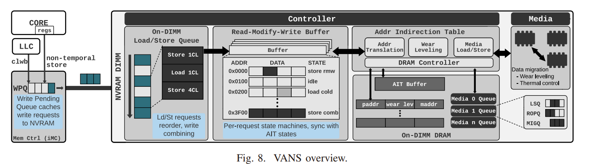

# BG Knowledge

## DRAM, RAM, Main Memory

[basic concept](https://baike.baidu.com/item/%E5%8A%A8%E6%80%81%E9%9A%8F%E6%9C%BA%E5%AD%98%E5%8F%96%E5%AD%98%E5%82%A8%E5%99%A8/12717044?fromtitle=DRAM&fromid=149572&fr=aladdin)；

## Persistent Memory

[学习网址1](https://www.intel.la/content/www/xl/es/products/docs/memory-storage/optane-persistent-memory/optane-dc-persistent-memory-brief.html)、[学习网址2](https://www.intel.com/content/www/us/en/developer/articles/training/how-to-emulate-persistent-memory-on-an-intel-architecture-server.html)；

**Introducing Intel® Optane™ Persistent Memory**


**implementation**

具有与 DRAM 几乎相同的速度和延迟以及 NAND 闪存的非易失性。 NVDIMM（非易失性双列直插式内存模块）和 Intel 3D XPoint DIMM（也称为 Optane DC 持久内存模块）是持久内存技术的两个示例。

应用场景：[reference](https://www.netapp.com/data-storage/what-is-persistent-memory/)：

欺诈识别 Fraud detection；

网络威胁分析 Cyberthreat analysis；

网络规模个性化 Web-scale personalization；

金融交易Financial trading，用持久内存来快速处理和执行金融交易

物联网（loT），实时更快地处理大量数据集

## RECIPE

这个是论文中提及的open-source concurrent PM systems；[论文](https://arxiv.org/abs/1909.13670)在这里，暂时还未阅读；

RECIPE proposes a principled approach for converting concurrent indexes built for DRAM into crash-consistent indexes for persistent memory.

## crash-consistency

[网址1](https://www.infoq.cn/article/rh4wypy8nr3tezgdueoy)、[网址2](https://zhuanlan.zhihu.com/p/25188921)、[网址3这个比较重要](https://blog.shunzi.tech/post/dist-block-consistency/)；

简单举例：


程序按照open，write，delete，rename的顺序操作没有问题，但是如果调换了write和delete操作并且在删除操作生效之后立刻断电，就会出问题。


# Paper Reading

## pmrace

[Efficiently Detecting Concurrency Bugs in Persistent Memory Programs](https://dl.acm.org/doi/10.1145/3503222.3507755)；论文笔记见原文；

[会议分享](https://www.youtube.com/watch?v=kDYQQQ7LJYQ&list=PLsLWHLZB96Vf0c9SH5EBtsQj-8WqPtC1p&index=61)；

造成PM出现consistency  bug的两个原因：

1.


2.


crash-inconsistency in concurrent executions:


目前没有该领域的相关工作；

解决发现并行PM中的crash-inconsistency bugs存在的挑战：

1.possible interleaving有太多种可能：


2.容易把非bug识别成bug（false possitive）

论文总结了两个bug pattern：


解决方案PMRace(a fuzzer for PM)的架构:


"exploration" will guide fuzzing to test new interleavings（dirve the execution towards finding candidate）


PM chackers:


post-failure validation:


举例：


实验：

实验主要从两方面来做的：

1个是确定究竟可不可以引导发现更多的candidates，guide fuzzing to test new interleavings（dirve the execution towards finding candidate）

2是找出来的candidates、“real candidates”、false positives究竟有多少，从而评判accuracy；

可拓展之处：见论文的discussion和前面部分标注；


[github项目](https://github.com/yhuacode/pmrace)；git尝试：

```terminal
#In terminal, in dirctory pmrace
conda activate --name Summer python=3
sudo apt-get install build-essential autoconf pkg-config \
                git python3 python3-dev \
                m4 pandoc libndctl-dev libdaxctl-dev \
                libelf-dev elfutils libdw-dev libunwind-dev
git init#不输入这个会报错
git submodule init && git submodule update --progress
cd ./deps/pmdk
git apply ../../patches/pmdk.diff

#There are some enviroument variables to be set.
gedit ~/.bashrc
$ export PMEM_IS_PMEM_FORCE=1
$ export LLVM_DIR=/path/to/llvm-11-install-dir
$ export PATH=$LLVM_DIR/bin:$PATH
$ export PMRACE_DIR=/path/to/pmrace
#进入instrumnet目录
cd $PMRACE_DIR/instrument
#make的时候出错，应该是路径设置没有配好。但是自己装了llvm
```

[vagrant project](https://github.com/yhuacode/pmrace-vagrant)；


## Havoc

[One Fuzzing Strategy to Rule Them all](chrome-extension://cdonnmffkdaoajfknoeeecmchibpmkmg/assets/pdf/web/viewer.html?file=https%3A%2F%2Fshadowmydx.github.io%2Fpapers%2Ficse22-main-1314.pdf)；

介绍的是havoc方法；

模糊测试背后的机制（讲座：[会议链接](https://meeting.tencent.com/dm/OWc2k2gPNNu2)）;


以coverage为导向，定义成一个优化问题：


但是在不同的论文中，评估实验得到的影响效果是存在一些矛盾的：


**Havoc**

seed——多个mutation operator序列进行mutate（mutator stacking，size是2-128,2的幂，对mutator是随机的）——输入程序——是否扩大coverage；


经过很多实验，发现这个方法效果很不错；为什么这个方法如此优秀：


1.不同的benchmark对stack size有偏好；2.不同的benchmark对不同类型的mutator分类也有偏好；

因此可以“指引”havoc，而非随机。使用MAB方法，[Multi Armed Bandit](https://blog.csdn.net/LagrangeSK/article/details/81010195)；

# Other Crash-Consistency Bugs in PM

[论文1](https://arxiv.org/pdf/2204.06066)（FLYTRAP）

many of the bugs are due to logic errors, rather than errors in using flushes or fences;

many bugs arise from attempts to improve efficiency by performing metadata updates in-place and that recovery code that deals with rebuilding in-DRAM state is a significant source of bugs;

# PM Simulators/Emulators

[How to Emulate Persistent Memory Using Dynamic Random-access Memory](https://www.intel.com/content/www/us/en/developer/articles/training/how-to-emulate-persistent-memory-on-an-intel-architecture-server.html)；

[使用内存DRAM模拟持久化内存Persistent Memory](https://www.intel.com/content/www/us/en/developer/articles/training/how-to-emulate-persistent-memory-on-an-intel-architecture-server.html)；

首先得有kernel，安装进度如下：（参照[网址](https://www.cyberciti.biz/tips/compiling-linux-kernel-26.html)）:

```terminal
unxz -v linux-5.18.1.tar.xz
wget https://cdn.kernel.org/pub/linux/kernel/v5.x/linux-5.18.1.tar.sign
gpg --verify linux-5.18.1.tar.sign
#终端会输出公钥
gpg --recv-keys 公钥
```

但是这里遇到一些问题：


# 第一次会议小结

simulator that can modified；

目前所有的论文都是在：觉得存在/想到某个bug，然后去进行解决；

而我们要做的工作，就是，找出这些Bug；一次性都找出来。

run PM on simulator：（文章在讲这个simulator）

http://web.cs.ucla.edu/~harryxu/papers/jaaru-asplos21.pdf

看看它引用了什么别的simulator，再看看有没有更新的，相关工作引用了这个simulator的论文；

PMDK；

want to control of the internel of emulator; 就比如对于三个操作，中间可以加入crush之类的，从而检验很多共性的bug；

关注：find a simulator, learn deeply, after learning deeply, then we can try to use simulator to go through PM and detect the bug;

必须非常细致的知道simulator的细节；得很清楚的讲清楚。下周的任务；

https://github.com/HewlettPackard/quartz

# -------------------

# Jaaru

[youtube视频](https://www.youtube.com/watch?v=YvnQwRd8ckk)；[论文网址](https://doi.org/10.1145/3445814.3446735)；

论文概述：

简单介绍PM；

PM的主要挑战：program crash;

tools for modeling and checking persistent memory programs以及他们存在的问题:


因此，需要一个exhaustive tools that can find real bugs with no manual efforts.因此开发了Jaaru；


开发jaaru面临的主要挑战（看原论文）

observation:(也要好好看原文)


Jaaru的具体介绍：


阅读论文中的constraint-refinement algorithm;

Jaaru架构：


Evaluations：(详细看原论文)

​	on RECIPE and PMDK benchmarks；

# Jaaru (github)

除了github的网址之外，还有[这里](https://plrg.ics.uci.edu/jaaru/)；

**Building PMCPass**：

Jaaru requires an LLVM pass (i.e., PMCPass) to annotate all loads/stores of your tool. You can download the binary file from [here](https://drive.google.com/drive/folders/1FH6uKohoSZXrf1Twq55ZUTI6DzNVYzts?usp=sharing) or build the PMCPass with LLVM. To build it you need to download LLVM and register our pass and build it:

```
git clone https://github.com/llvm/llvm-project.git
git clone https://github.com/uci-plrg/jaaru-llvm-pass
cd llvm-project
git checkout 7899fe9da8d8df6f19ddcbbb877ea124d711c54b
cd ../jaaru-llvm-pass
git checkout 0b639997a1a990cfaa0adb29a4f3a1c9f784d8ca 
cd ..
mv jaaru-llvm-pass llvm-project/llvm/lib/Transforms/PMCPass
```

To register our pass in LLVM append ‘add_subdirectory(PMCPass)’ to CMakeLists.txt file in ‘Transforms’ directory by using the following command:

```
echo "add_subdirectory(PMCPass)" >> llvm-project/llvm/lib/Transforms/CMakeLists.txt
```

After registering the pass, use the following commands to build it:

```
cd llvm-project
mkdir build
cd build
cmake -DLLVM_ENABLE_PROJECTS=clang -G "Unix Makefiles" ../llvm
make
```

会议小结

keep digging

# -------------------

# Bug Pattern Summary

由于重置了一次系统，有的C盘的md截图丢失，详情查看bug_pattern_sum.pdf即可。

# -------------------

# previous Plan

focus on 3 papers:

​	https://ieeexplore.ieee.org/abstract/document/6853222

​	https://dl.acm.org/doi/abs/10.1145/3371079

​	vans

# Persistency Model

## BG knowledge

1. 典型的处理器（Processor）往往包含多个核心（Core），各个核心私有 L1/L2 缓存，而共享 L3 缓存和内存控制器。 – [Intel® Xeon® Scalable Processors](https://blog.csdn.net/maokelong95/article/details/78604037)；

2. 什么是一致性模型：一个用来规定新值什么时候传播到某一指定处理器的策略。所谓缓存一致性协议也即一个用来将修改过的缓存副本传播给别的缓存的算法。前者确定的是时间，后者确定的是传播的方式。
3. Memory Persistency：用于约束内存持久化指令完成顺序的内存持久性模型，主要就是为了persistent memory服务的。核心主张是通过扩展内存一致性模型，1) 帮助架构师挖掘持久化指令的指令级并行度，2) 帮助编程者推理崩溃一致性。

## Memory Consistency Model

[学习网址1](https://blog.csdn.net/maokelong95/article/details/80727952)；[学习网址2](https://blog.csdn.net/maokelong95/article/details/81199226)；


关键问题是，在执行完C=1之后，并非所有处理器都能看到C被更新的最新的值。

**顺序一致性 sequential consistency**：其中有两个关键：程序顺序program order（The operation of each processor maintains the order specified by the program.）和原子性atomicity（Each processor can see the result of a memory access instruction at the same time）。


但是顺序模型的缺点是，许多编译器可以使用的基于重排序的优化都无法进行：代码移动、寄存器染色啊、子表达式消除等。

**宽松一致性 Relaxed Consistency**：降低顺序一致性的需求。

1写后读的顺序可以改变.例如：可能M2->M1或者M4->M3;


 `mov [_x], val` 表示 store 指令，其中 val 将被存储到内存的 x 位置中；`mov r, [_x]` 表示 load 指令，其中内存 x 位置中的数据将被读取到寄存器 r 中。

2写后写和读后读写的顺序不可以改变。

3原子性上，不能提前读取到别的处理器的写操作。某个核心/处理器修改了变量 x 之后，别的处理器要么都看到这个修改，要么都没看到这个修改。

4原子性上，但是处理器自身，可以在先”看到“本处理器的写操作之后继续运行下去，而不必等待其他所有处理器都”看到“这个写操作。

**但是宽松一致性模型也可以重新变得严格起来，需要使用Safety Net实现**。可以查看[这个网址](https://blog.csdn.net/maokelong95/article/details/80727952)。安全网大概有两类：A. read-modify-write；B. membar。


为了解决PM中的内存一致性问题，目前最认可的方案是通过调用持久化指令（call persistence operations）；（例如CLFLUSH, CLFLUSHOPT,CLWB, NTSTORE, LFENCE, MFENCE, SFENCE）而这些持久化指令的执行效率很重要。因此可以通过relax persistence command order从而提升效率，而Memory Persistency就是做这个的。

## Memory Persistency Model

**strict persistency**; persist order observes all happens-before relations implied by volatile memory

**relaxed persistency**: 

​	A. epoch persistency; 


​	B. strand persistency; 


# VANs

[工程文件](https://github.com/TheNetAdmin/VANS)；[论文网址](https://github.com/TheNetAdmin/LENS-VANS)；笔记见论文；



工程文件成功跑通。

configuration file: `VANS/config/vans.cfg`；

只需要可以simulating persistency models即可。

# PM programming

常见的指令有：CLFLUSH, CLFLUSHOPT,CLWB, NTSTORE, LFENCE, MFENCE, SFENCE等。

[参考网址1，一个博客](https://blog.csdn.net/maokelong95/article/details/81362837)；[参考网址2，是一个论文关于PM programming的论文](chrome-extension://cdonnmffkdaoajfknoeeecmchibpmkmg/assets/pdf/web/viewer.html?file=https%3A%2F%2Fwww.usenix.org%2Fsystem%2Ffiles%2Flogin%2Farticles%2Flogin_summer17_07_rudoff.pdf)；

常用x86指令介绍：

CLFLUSH（Cache Line Flush，缓存行刷回）若该缓存行（Cache Line）中的数据被修改过，则将该数据写入主存；

CLFLUSHOPT（Optimized CLFLUSH，优化的缓存行刷回）作用与 CLFLUSH 相似，但其之间的指令级并行度更高，比如在访问不同 CacheLine 时，CLFLUHOPT 可以乱序执行（in a relaxed way）。

CLWB（Cache Line Write Back，缓存行写回）作用与 CLFLUSHOPT 相似，但在将缓存行中的数据写回之后，该缓存行仍将呈现为未被修改过的状态。

NT STORES（Non­Temporal stores） 是一系列用于存储不同字长数据的指令，NT Stores 指令在传输数据时能够绕过缓存，而直接将数据写入主存。

FENCE 指令，也称内存屏障（Memory Barrier），起着约束其前后访存指令之间相对顺序的作用。其包括 LFENCE（约束 Load 指令）, MFENCE（约束 L/S 指令）, SFENCE（约束 Store 指令）。

指令间的顺序约束表格（order constraints between operations）：


# Questions

1. how to use VANs project? Select VANs as the baseline of our project? (Add, delete and modify the code of the baseline)（先simulate PM,再simulate heardware，第三个goal就是更好的适用到其他PM model)

2. what strategies we might use to detect ALL of the bugs? 可以参考集成各类bug patterns中的办法。（模拟crash；use existing PM files to start a new execution等)

3. confused about  PERSISTENCY and CONSISTENCY, what exactly do they mean in our  program?
   1. Memory consistency and crash consistency, **no consistency**.
   2. Persistency model is defined in the paper


Focus:

1. simulator(x86); how to explore bug patterns using it;
2. VANs


# 问题和小结

可以查查formal verification进一步了解；

goal: 首先是先随机生成一些program（simplify different bugs programs into simple examples），用来帮助发现一些bug patterns；第二步是检测现实应用中的问题。

阅读LLVM PASS(why?作用没有听的太清楚)

explore Persistency Model: memory persistency.(那个论文讲的比较simplified)

# -------------------

# explore vans

见文件`vans_code.pdf`。

# 问题和小结

学习PM的好办法：手动尝试一些emulator和simulator，尝试进行一些简单的相关编程。可以有不错的学习效果；

Store operation is for volatile memory, and persist operation for persistent memory, right? PM has both types of operations, right?

在访问的时候，使用的是load and store。使用PM，在对一个变量write之后，需要用flush and fense才可以。fense只保证fense前后操作的顺序。需要仔细阅读一下persistenct semantics of x86;

无论在PM里，还是在易失性存储，都需要“读”CPU的cache；

how to imply a simulator to simulate the persistent models；


理解代码，wirte emulator that can simulate different models;

然后简化bug patterns；

# -------------------

简化bug patterns 和vans见其他文件；

general work见其他文件；bug classification也见其他文件；

1. Based on the current simplified bug patterns, try to design tools to find simple bug patterns, think about how to identify bug patterns and reduce to bug patterns that we know. We could detect the inconsistency after the crash.
2. Not only check constraints from the buggy program, but also check the recovery function, so we can later extract the constraint ourselves.
